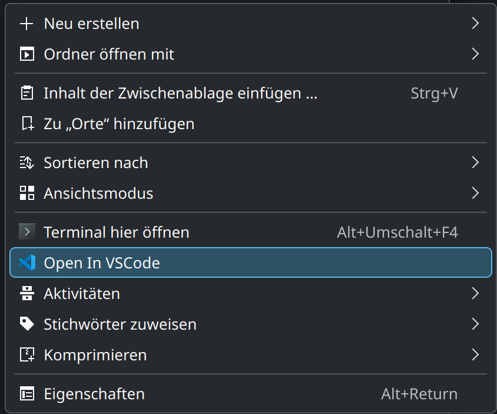

# Open in VS Code Submenu Entry for Dolphin

See [here](https://develop.kde.org/docs/apps/dolphin/service-menus/) for more information.

## Installation
```
mkdir -p ~/.local/share/kio/servicemenus
mv openinvscode.desktop ~/.local/share/kio/servicemenus/
```

## Result
